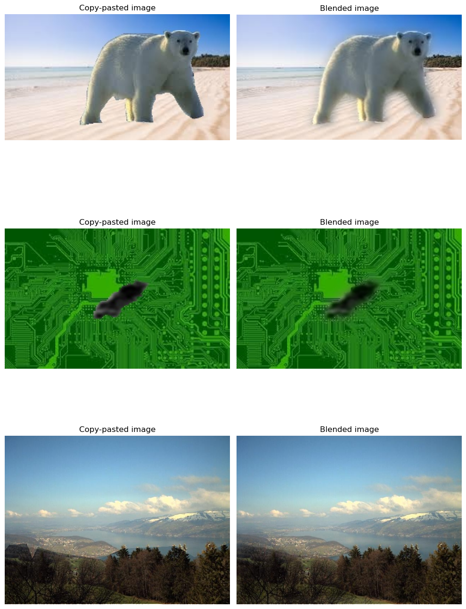
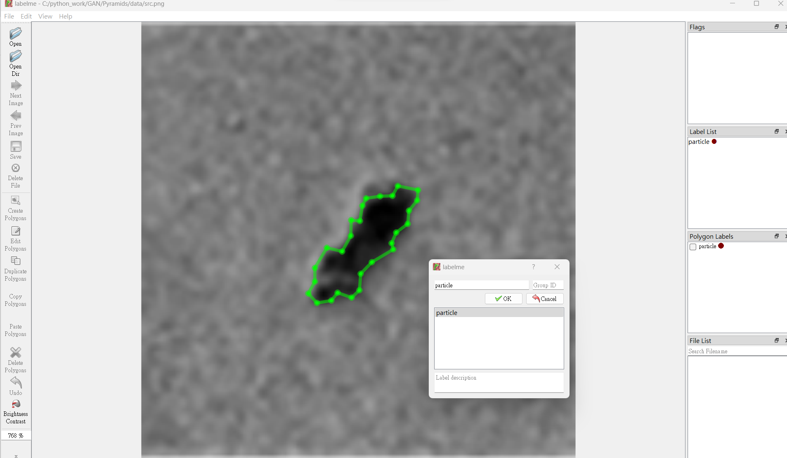
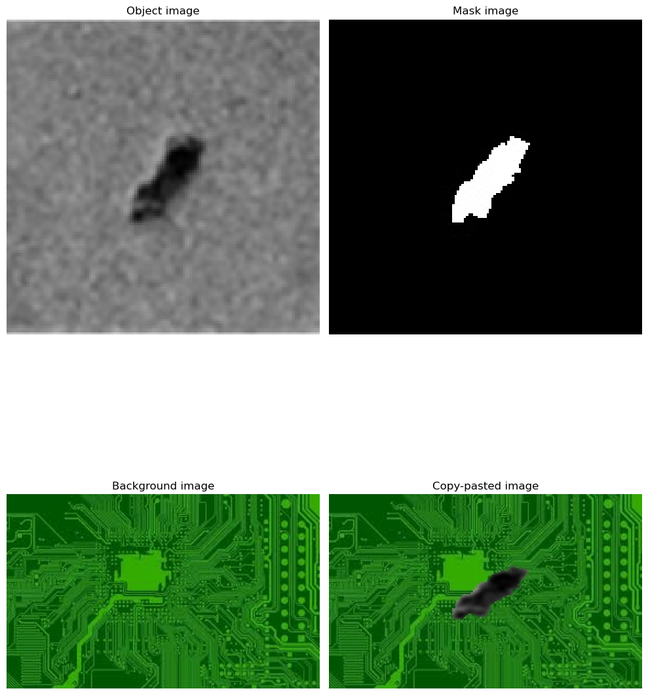

# Image_Blending_Pyramids
Image blending skill implementation with Python OpenCV.
Upon this skill, it will make edge of synthesis image more smoothly instead of looking so sharp.
You can add processed synthesis images to images dataset, thereby improving the recognition rate of the image recognition model. 

## Blending result
After cropping the object of interest and pasting it into a new background image, you can use image blending techniques to remove sharp image edges.
Look!The image looks more naturally!



## Getting Started
### Installation
Code tested in python 3.7.0, OpenCV 4.8.0 and  Labelme 5.2.0 .
Install the requirements with:\
`pip install -r requirements.txt`

### Image Processing
1. Download your own two domain(Object+Background) dataset from google image.
2. Use labelme to crop image and make mask.

```
   python Labelme_json_to_mask_jpg.py"
```
3. Pasted cropped image on background image.

4. Use image blending skill.
```
   python Image_Pyramids.py"
```
